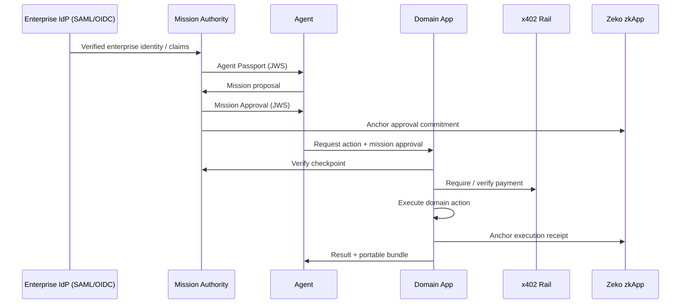
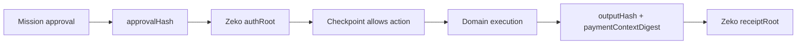
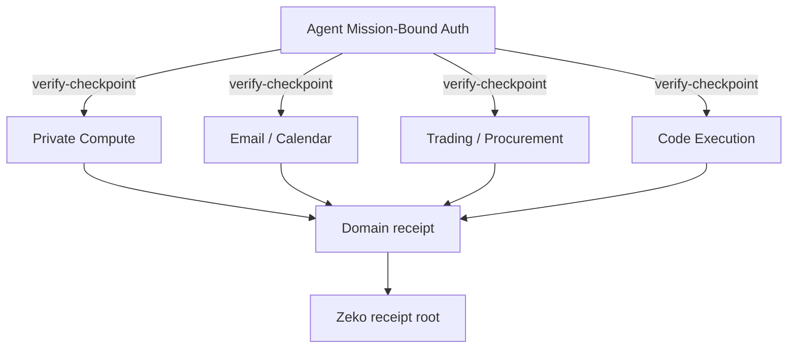

# Architecture

## Protocol Flow

## Approval Before / Receipt After

## Where Domain Apps Plug In

The bundled private-compute UI is one reference domain adapter. Replace it with any app that can call `verify-checkpoint` before work or side effects.
