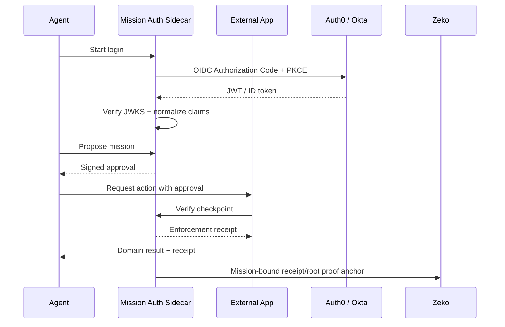

# Agent Mission-Bound Auth

Use this skill to keep the protocol work crisp: this is auth for autonomous-agent workflows, not a one-off application. The demo harness is a tutorial and test surface; the protocol artifacts are the durable product.

## Core Positioning

Frame the protocol as:

> Agent Mission-Bound Auth: Cryptographically Verified and Enforced Autonomous Agent Workflows

Prefer "Auth for autonomous agents" over "OAuth for autonomous agents." OAuth/OIDC and SAML SSO are enterprise entrypoints; the protocol extends into mission approvals, private-compute commitments, receipt enforcement, payment linkage, and Zeko anchoring.

When writing explainers, focus on the four gaps:

1. Agent identity: who is the agent, who does it represent, and who vouches for it.
2. Agent scope: what exact task, data, tools, rails, budget, and expiry constrain the agent.
3. Agent approvals: who or what approved the mission, and how downstream services verify it.
4. Agent enforcement: how checkpoints and receipts prove the agent stayed inside the mission.

Reference adjacent work sparingly: MCP Auth, Okta Cross App Access, and mission-bound OAuth research are enough for credibility without turning the piece into a literature list.

## Protocol Shape

Preserve this flow:

1. Verify enterprise identity through Auth0, Okta, generic OIDC, or a SAML-backed broker.
2. Normalize provider-specific claims into canonical agent, organization, scope, budget, rail, and dataset claims.
3. Build stable commitments over normalized claims and salts.
4. Issue or verify mission approvals that bind task, tools, datasets, rails, budget, expiry, and checkpoints.
5. Verify checkpoints before payment, private compute, external side effects, and receipt finalization.
6. Emit receipts that link `authCommitment`, `policyHash`, `datasetCommitment`, `outputHash`, and `paymentContextDigest`.
7. Anchor approval roots, receipt roots, or revocation roots on Zeko.

Do not reduce the protocol to a login button. Login establishes identity; the mission and receipt artifacts establish enforceable authorization.

## Provider Integration Rules

For Auth0 and Okta:

- Use Authorization Code + PKCE for browser-facing flows.
- Verify JWTs against the provider JWKS.
- Check issuer, audience, expiry, nonce/state, and token type.
- Normalize provider claims before computing commitments.
- Keep secrets in `.env.local` or host environment only.

For Okta:

- Prefer the org issuer for simple SSO demos unless a custom authorization server is configured.
- Use `/oauth2/default` only when the tenant has an access policy/rule that allows the app and scopes.
- Treat empty custom scopes from org issuer as acceptable for SSO-only demos; mission scopes live in the protocol layer.

For customer IdPs:

- Use `OIDC_PROVIDERS_JSON` to configure generic providers.
- Keep provider names stable because they become part of normalized claim and commitment context.

## Zeko And Payment Guidance

Zeko is the verifiability layer, not a mandatory runtime dependency for every demo run.

Use Zeko for:

- privacy-preserving commitments over authorization and compute context
- durable anchoring for approvals, revocations, receipt roots, or rolling roots
- verifiable private-compute receipts without raw data disclosure
- conditional payouts when settlement is tied to valid authorization, compute, and receipt proofs

Use the x402 payment context as a digest-bound rail abstraction. Zeko is the native rail; Ethereum and Base can share the same shape with different chain parameters. Arc and Tempo can be included as preview/configuration rails when the chain-specific settlement adapter is not implemented.

Recommended chart wording:



## Build And Verification Checklist

Before publishing or opening a PR, run the local checks from the demo root:

```bash
npm test
npm run smoke:protocol
npm run test:conformance
npm run demo:reviewer
```

If real sandbox provider credentials are available locally, also run:

```bash
npm run oauth:sandbox-doctor
npm run test:oauth-sandbox
```

Never commit `.env.local`, private deployer keys, generated zkApp keys, `node_modules`, or `dist-zkapp`.

## Repo Packaging

For the canonical repo, keep the protocol source, docs, SDK, schemas, harness, and Zeko zkApp scripts together.

For `zeko-labs/developer_demos`, copy the canonical repo into:

```text
agent-mission-bound-auth/
```

Use the destination repo's conventions:

- Keep Apache-2.0 license metadata.
- Preserve the existing `Readme.md` casing if the destination already uses it.
- Stage only `agent-mission-bound-auth/` for the PR.
- Watch for case-sensitive filename collisions in the larger demo repo and keep unrelated changes unstaged.

PR summary should say that this is a protocol-first sidecar/tutorial with Auth0, Okta, generic OIDC, mission approvals, private-compute receipts, x402 payment context, and Zeko anchoring.
